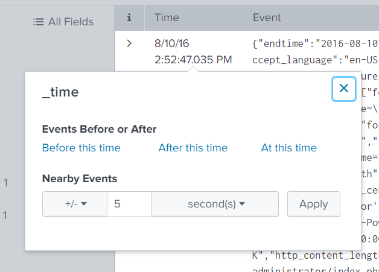
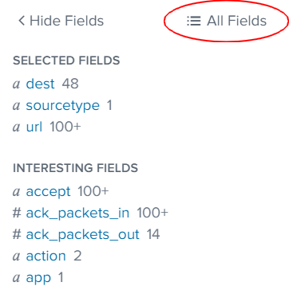

# Splunk

## Example

```sourcetype = syslog ERROR | top user | fields - percent```

### Splunk implied AND

`sourcetype=syslog ERROR` tells the search command to retrieve only events that have a `sourcetype` equal to `syslog` AND contain the term `ERROR`. Encase it in quotes eg. "Dream Crusher" to search combined terms. When no operator is specified, AND is implied.

### top user

`top` returns top 10 most common values for specified field`

### fields - percent

Tells Splunk to remove field **percent** from output of `top` command.

## Mapping available sources, hosts and sourcetypes

1. List all available *sourcetype*s for an index with `| metadata type=sourcetypes index="botsv1"`
2. Slightly better: See all available sources `| metadata type=sources index="botsv1" `
3. List with firstTime, lastTime
```
| metadata type=sources index="botsv1" 
| convert ctime(firstTime) as firstTime 
| convert ctime(lastTime) as lastTime 
| convert ctime(recentTime) as recentTime
```
4. See all hosts
```
| metadata type=hosts index="botsv1" 
| convert ctime(firstTime) as firstTime 
| convert ctime(lastTime) as lastTime 
| convert ctime(recentTime) as recentTime
```
5. List all indices `| eventcount summarize=false index=* | dedup index | fields index`

### Pipes

Work similar to Linux. 

### Sub-searches

```sourcetype=syslog [search login error | return user]```

Here, a search for events having the terms login and error is performed, returning the first **user** value found, say **bob**, followed by a search for **sourcetype=syslog user=bob**.

### Misc notes

1. Keyword arguments to `search` are case-insensitive, but field names are.
2. To include quotes in search, escape them with with '\'
3. Backslashes must be escaped `index=botsv1 "\\System\\MountedDevices"`
4. To search for Boolean keywords AND, OR, NOT need to be encased in quotes, otherwise just use them.
5. Field names are case sensitive, field values are not eg. `host=www3` and `host=WWW3` return diff results.
6. Splunk understands IP ranges, `clientip="202.201.1.0/24"` and `clientip="202.201.1.*"` are acceptable.
7. `status != 200` and `NOT status = 200` different, latter also returns events where **status** field doesn't exist.
8. `index=_internal earliest=-15m latest=now | fieldsummary | table <field1> <field2>` Try this
9. To check if app is making any outward connection
```
index=botsv1 source="WinEventLog:Microsoft-Windows-Sysmon/Operational" src_ip="192.168.250.100"
```

## Splunk overview

1. Search -> Data summary button shows you hosts, sources, sourcetypes

### Search events within a specific time interval before/after event



## Extract field from Splunk

`| stats values(md5)` Extracts unique field md5 from event

## DNS lookups

1. Reverse:
```index=botsv1 sourcetype=stream:dns answer=23.22.63.114```

2. Forward:
```index=botsv1 sourcetype=stream:dns query=prankglassinebracket.jumpingcrab.com```

3. This seems to work better:
```index=botsv1 sourcetype=stream:dns | search name{}="prankglassinebracket.jumpingcrab.com"```
```index=botsv1 cerberhhyed5frqa.xmfir0.win "dns.type"=answer```

Refer to [this](https://support.umbrella.com/hc/en-us/articles/232254248-Common-DNS-return-codes-for-any-DNS-service-and-Umbrella-) to interpret DNS return message.

## Filter to rule normal DNS queries
Start with this, add more if necessary and investigate the rest
```
index=botsv1 sourcetype=stream:dns query_type{}=A
   NOT query=wpad*
   NOT query=isatap*
   NOT query=*.windows.com
   NOT query=*live.com
   NOT query=*nsatc.net
   NOT query=*windowsupdate.com
   NOT query=*msedge.net
   NOT query=*trafficmanager.net
   NOT query=*office.com
   NOT query=*bing.com
   NOT query=*virtualearth.net
   NOT query=*msn.com
   NOT query=*.microsoft.com
   NOT query=*msftncsi.com
   NOT query=*microsoftonline.com
   NOT query=demo-01
   NOT query=*waynecorpinc.local
   NOT query=*public-trust.com
   NOT query=*ocsp*.com
   NOT query=*akamaiedge.net
   NOT query=*akadns.net
   NOT query=*akamaized.net
   NOT query=sway-cdn.com
   NOT query=*symc*.com
   NOT query=*.googleapis.com
   NOT query=*.dynect.net
   NOT query=*.arin.net
   NOT query=*.joomla.org
   NOT query=*.twimg.com
   NOT query=*.acronis.com
   NOT query=*.skype.com
| stats count by query
```

Then to investigate a particular DNS query
```
index=botsv1 sourcetype=stream:dns record_type=A query{}=cerberhhyed5frqa.xmfir0.win | table _time, src_ip, dest_ip | sort _time
```

### Keyboard shortcuts

1. `Ctrl \` to autoformat search fields

### Show fields as filters 

Note only fields which occur in >20% of events are marked interesting



## Splunk default always indices

| **Field**  | **Answers the question**              | **Examples**                                                        |
|------------|---------------------------------------|---------------------------------------------------------------------|
| Source     | Where did the data come from?         | files (/var/log/), scripts  (myscript.bat), network feeds (UDP:514) |
| sourcetype | What kind of data is it?              | access_combined,syslog                                              |
| host       | Which machine did the data come from? | webserver01, cisco_router                                           |
| _time      | When did the event happen?            | Sat Mar 31 02:16:57 2012                                            |

## Splunk output pipes

1. `| table <field>` returns table of all output with selected field
2. This can be further formatted by renaming the fields as follows
```
index=botsv1 imreallynotbatman.com sourcetype="stream:http"
| table src_ip, dest_ip, status, dest_headers
| rename dest_headers as "Response Headers", status as "HTTP code"
```
Note that once renamed, you can't pipe it to be *table* anymore with the original name eg. *dest_headers* no longer exists, only *Response Headers*
3. `| dedup <field1>, <field2>` will show just unique events which don't have same field1, field2 entries.

4. `| top src_ip` returns to 10 events for field *src_ip* with statistics **count**(hits) and **percent**, can specify more with `limit=<number>`

5. `| rare` the opposite of `| top`

6. `| stats count as <renamed field>` displays number of events with matching criteria

7. `| stats count by user, app, status` Returns count by unique combination of all 3 fields or just 1 if you want to count.

8. `| stats list(hostname) as "Websites visited" by username` Lists the websites visited by username.

9. `| stats distinct_count(hostname) as "Websites visited"` Count number of distinct websites visited.

10. `| stats values(user), count(user) by src_ip` *values* lists all unique entries for specified field

11. `| sort ip, -url` sorts by IP (ascending) then by url (descending)

12. May have to select field `part_filename{}` to make it visible to find uploaded exe.

13. ```
index=botsv2 sourcetype="stream:http" url="http://store.froth.ly/magento2/customer/account/loginPost/" 
    | rex field=form_data "&login\[username\]=(?<username>\S+@\S+)&login\[password\]=(?<pwd>\S+)&send=" 
| stats values(username) count by pwd
    ```
    
    
### Windows Sysmon threathunting in Splunk

1. Lists all command line execution in Windows with ProcessID and ParentProcessID with suspicious value.
```
index=botsv1 sourcetype="XmlWinEventLog:Microsoft-Windows-Sysmon/Operational" <osk.exe or *.vbs or whatever>
| table _time Computer ParentCommandLine CommandLine ParentProcessId ProcessId   
| reverse
```
2. Note that if Sysmon ID 1 is not available, look for 4688 instead. ProcessID there are in hex.
3. You may need to isolate by Computer or host first to trace command execution.
```
index="main" EventCode=1 | sort _time | table _time ParentProcessId ProcessId ParentCommandLine CommandLine
```
4. `index=botsv1 "\\System\\MountedDevices"` Check Registry if USB drive mounted ([link](https://www.blackbagtech.com/blog/analyzing-usb-entries-in-windows-7/))
5. Check for volume name of USB drive `index=botsv1 friendlyname | table host object data`
6. Sometimes specifying the IP to screen for workstation hostname doesn't return correct results. Search the workstation name instead.
7. Event ID 2 tells us a file creation time is modified, it may be indication of ransom ware.
8. Know when to pivot on time. The labs and SANS Holiday Hack Challenge 2019 have a scenario which teaches this. Limit the information by Computer, **src_ip**, Event ID 1 or **Image** field to get more relevant results.
  1. Lab scenario 1 - Once detected connection to strange domain name, pivot on time to view Sysmon logs. Suspect computer compromised.
  2. SANS 2019 - Once you find a strange PowerShell command, ask how it got there, pivot out of PS logs.

    3 Fields to try looking at: Image, (Parent)CommandLine, (Process)CommandLine or search for "file" in field name.
11. Use `reverse`, easier to trace follow through sequence of events.

12. To find hash of file run as executable process, look for ID 1, Image=**path/to/file** and Hashes field to lookup on [virustotal.com](https://virustotal.com/)

13. Use Event ID 3 to detect unusual network connections such as reverse shells o

    ```
    index=botsv1 "1.2.3.4" "5.6.7.8" 
    | reverse
    | table _time ComputerName SourceIp SourcePort DestinationIp DestinationPort Image
    ```

#### **Search queries for reference** 

These were taken from practicing search queries in BOTS

1. Notes on **rex**. How to use to filter unique values. This one has escaped `\` twice.

```
index=botsv1 "*.pdf" EventCode=5145 Relative_Target_Name="*" 
| rex field=Relative_Target_Name "\\\(?<pdfname>\w+.pdf)" 
| dedup pdfname 
| table pdfname
```

2. Display length of values of field loginpw

```
index=botsv1 sourcetype=stream:http src_content=*username*passwd* dest_ip=192.168.250.70 
| rex field=src_content "passwd=(?<loginpw>\w+)" 
| eval length=len(loginpw) 
| table loginpw, length
```

3. Display occurrences of fields with specific values eg. show number of hits of passwords of varying length

```
index=botsv1 sourcetype=stream:http src_content=*username*passwd* dest_ip=192.168.250.70 
| rex field=src_content "passwd=(?<loginpw>\w+)" 
| eval length=len(loginpw)
| stats count by length
```

4. Calculate average of field value.

```
index=botsv1 sourcetype=stream:http src_content=*username*passwd* dest_ip=192.168.250.70 
| rex field=src_content "passwd=(?<loginpw>\w+)" 
| eval length=len(loginpw) 
| stats avg(length)
```

5. To work with ID 4688 instead of Sysmon ID 1, have to convert process_id from hex to dec ([link](https://www.youtube.com/watch?v=qbIhHhRKQCw))

```
index=botsv1 EventCode=4688 
| eval hex_convert_pid=tonumber(process_id,16)
```

6. Url-decode in Splunk ([link](https://docs.splunk.com/Documentation/Splunk/8.0.3/SearchReference/TextFunctions))

```
index=botsv2 sourcetype="stream:http" "45.77.65.211" "<script>" 
| dedup form_data 
| eval decoded=urldecode(form_data)
| table decoded
```

7. This works to filter MAC, try to filter _raw

```
index=botsv2 "mallory" sourcetype="stream:http" 
| regex _raw="([0-9A-Fa-f]{2}[:-]){5}([0-9A-Fa-f]{2})"
```

8. Calculate Shannon score of value (note higher score [suggests](https://www.splunk.com/en_us/blog/security/random-words-on-entropy-and-dns.html) more randomness)
   1. For each entry

  ```
  index=botsv2 sourcetype=stream:dns (dest_ip=216.69.185.42 OR dest_ip=208.109.255.42) query=* 
  | rex field=query "(?<subdomain>\w+).hildegardsfarm.com"
  | `ut_shannon(subdomain)`
  | table dest_ip subdomain ut_shannon
  ```
   2. Total as average by IP/domain

  ```
  index=botsv2 sourcetype=stream:dns (dest_ip=216.69.185.42 OR dest_ip=208.109.255.42) query=* 
  | rex field=query "(?<subdomain>\w+).hildegardsfarm.com"
  | `ut_shannon(subdomain)`
  | stats avg(ut_shannon) by dest_ip
  ```

3. Search for range of values in field `sourcetype=mysourcetype myfield>=512 myfield<=514`

4. Find use of native Windows binaries (in notes **Endpoint Analytics**). Once you find results, exclude the legit Msft paths with NOT(A OR B OR C) until you are left with suspicious ones.

```
index=botsv2 source="WinEventLog:Microsoft-Windows-Sysmon/Operational" Image="*\\powershell.exe" OR Image="*\\msbuild.exe" OR Image="*\\psexec.exe" OR Image="*\\at.exe" OR Image="*\\schtasks.exe" OR Image="*\\net.exe" OR Image="*\\vssadmin.exe" OR Image="*\\utilman.exe" OR Image="*\\wmic.exe" OR Image="*\\mshta.exe" OR Image="*\\wscript.exe" OR Image="*\\cscript.exe" OR Image="*\\cmd.exe" OR Image="*\\whoami.exe" OR Image="*\\mmc.exe" OR Image="*\\systeminfo.exe" OR Image="*\\csvde.exe" OR Image="*\\certutil.exe" 
| stats values(CommandLine) by Image
```

5. Filtering out events with where

```
index=botsv2 sourcetype="stream:http" url="http://store.froth.ly/magento2/rest/default/V1/carts/mine/shipping-information" dest_content=* 
| dedup dest_content 
| rex field=dest_content "\"Grand Total\",\"value\":(?<gtotal>\w+),"
| where gtotal >= 1000
```

6. Group two fields by one field, such as listing form_data in HTTP POST with list of URLs by src_ip.

```
index=botsv2 sourcetype="stream:http" (src_ip=94.161.231.191 OR src_ip=56.0.107.146 OR src_ip=14.235.121.186 OR src_ip=210.174.213.34 OR src_ip=153.2.45.101 OR src_ip=203.149.168.246 OR src_ip=1.171.142.148) url="http://store.froth.ly/magento2*" http_method=POST 
| stats list(url),list(form_data) by src_ip
```

7. Sort by high `avg(ut_shannon)`

```
index=botsv2 sourcetype="stream:http" url="http://store.froth.ly/magento2/customer/account/loginPost/" 
| rex field=form_data "&login\[username\]=(?<usrname>\S+)@(?<domain>[\w\.]*)&login\[password\]" 
| `ut_shannon(usrname)` 
| stats avg(ut_shannon) count by domain
```

8. Search for two fields, group by email

```
index=botsv2 sourcetype="stream:http" url="http://store.froth.ly/magento2/customer/account/loginPost/" 
| rex field=form_data "&login\[username\]=(?<username>\S+@\S+)&login\[password\]" 
| stats list(src_ip), list(http_user_agent) count by username
```

9. Search and count distinct usernames using the same password

```
index=botsv2 sourcetype="stream:http" url="http://store.froth.ly/magento2/customer/account/loginPost/" 
| rex field=form_data "&login\[username\]=(?<username>\S+@\S+)&login\[password\]=(?<pwd>\S+)&send=" 
| stats values(username) count by pwd
```
## References

1. https://www.youtube.com/watch?v=xtyH_6iMxwA
2. https://www.youtube.com/watch?v=6lX4DOd1T-s
3. [Splunk operators](https://docs.splunk.com/Documentation/SplunkCloud/7.1.3/Search/Fieldexpressions)
4. [Sam Bowne's Splunk lectures](https://samsclass.info/50/50_S20.shtml) (really good)
5. [SANS Hack the Holidays 2019 Splunk talk](https://www.youtube.com/watch?v=qbIhHhRKQCw)